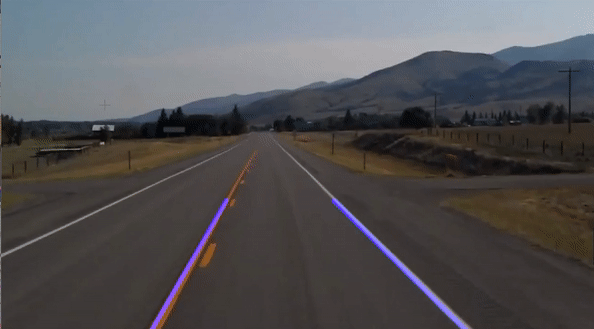

# **detect_lane**
## This repository contains a lane detection algorithm for detecting lane lines using python and OpenCV.
### **1. Clone this repository.**
### **2. Open the file in Jupyter Notebook.**
### **3. Run the cells and follow the instructions.**
### **3. Enjoy!**

### ***Final Result:***

#### **Credit: Rayan Slim (Identify Lane Lines with OpenCV & Python).**
